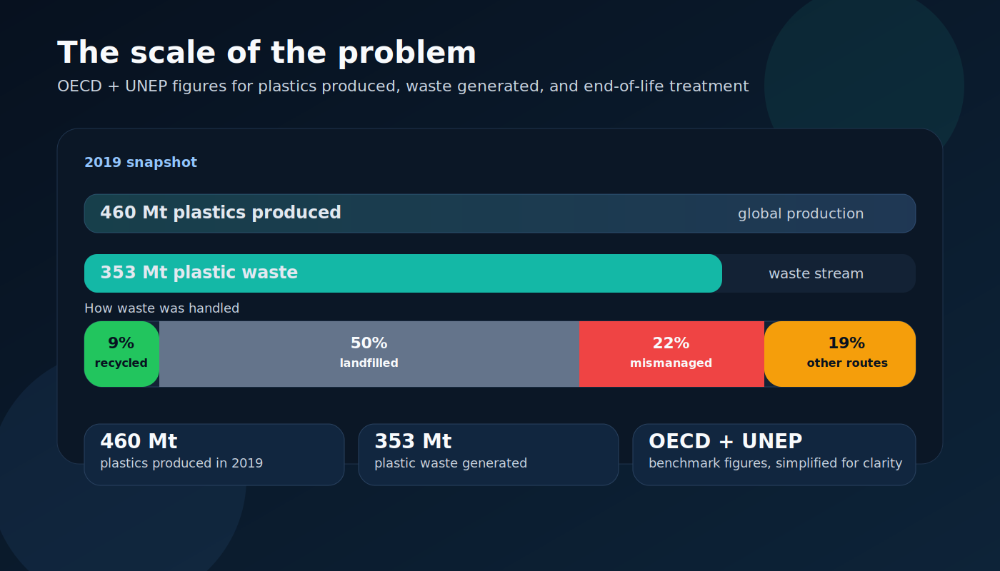
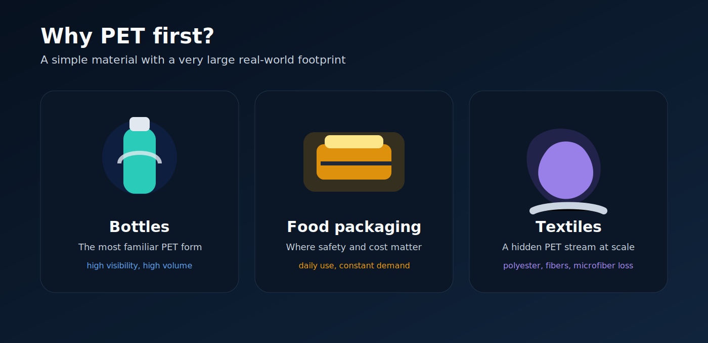
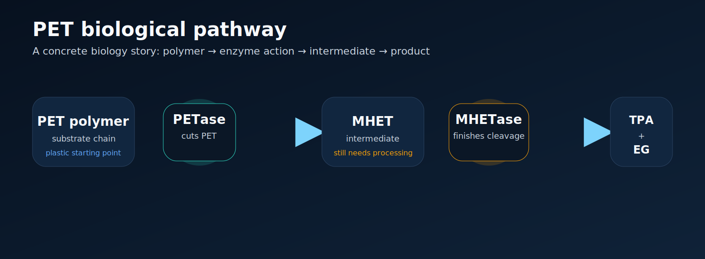

# BioMed: Building the Open Infrastructure Layer for AI-Driven Bioremediation

**A PET-first OpenEnv benchmark where scientific agents learn to reason through bioremediation workflows under uncertainty, constraints, and real experimental tradeoffs.**

**Links**

* [Project video](https://drive.google.com/file/d/1E5Q6DNojvahpWNRRlCUAaq4Q-TqijVgF/view?usp=drive_link)
* [Collab Notebook](https://colab.research.google.com/drive/1wDu723LyUvm3WL_MIPwPMczJMzxs6tUF#scrollTo=44VHyyTmibbg)
* [Problem statement video](https://drive.google.com/file/d/1Tl4btcO9BJSN1-o-DbJwHh1drMIUkOLi/view?usp=sharing)
* [Hugging Face blog mirror](https://huggingface.co/spaces/theRake/bioMed/blob/main/BioMed_blog.md)

**Key Artifacts**

* **Reward Curve:** `artifacts/reward_curve.png`
* **Loss Curve:** `artifacts/loss_curve.png`
* **Baseline Comparison:** `artifacts/baseline_comparison.png`

---

## Why this matters

Plastic pollution is easy to ignore until the numbers become impossible to ignore.

The OECD’s global plastics outlook reports that the world produced **460 million tonnes of plastics** in 2019 and generated  **353 million tonnes of plastic waste** . Only **9%** of that waste was ultimately recycled. Almost **50%** went to sanitary landfill, while **22%** was mismanaged through uncontrolled dumping, open burning, or environmental leakage. UNEP adds the image that stays with you:  **19–23 million tonnes of plastic waste leak into aquatic ecosystems every year** , roughly equivalent to **2,000 rubbish trucks a day** entering rivers, lakes, and seas. ([GitHub Docs](https://docs.github.com/en/account-and-profile/setting-up-and-managing-your-github-profile/customizing-your-profile/managing-your-profile-readme?utm_source=chatgpt.com "Managing your profile README - GitHub Docs"))

This is not only a waste problem.

It is a  **scientific discovery problem** , a  **systems problem** , and increasingly a  **public-health problem** . If we want AI systems that genuinely help with environmental science, they need more than static benchmarks and polished answers. They need environments where they can learn how science actually works: inspecting evidence, handling uncertainty, choosing experiments, updating beliefs, and making resource-aware decisions.

That is why we built  **BioMed** .

---

## What BioMed is

**BioMed** is a **PET-only, OpenEnv-native, hidden-state benchmark environment** for  **long-horizon bioremediation experiment planning** . It is designed to feel like a real scientific decision workflow: the agent must inspect evidence, choose structured actions, manage uncertainty, spend limited resources, and decide when to continue, pivot, or stop.

At its core, BioMed asks a simple but important question:

> **Can an AI agent behave like a disciplined scientific planner inside a remediation workflow, instead of merely talking about one?**

It is a first step toward the infrastructure needed to train and evaluate scientific AI systems on real decision-making loops.

---

## Why PET

It is widely used in  **beverage bottles, food packaging, and textiles** , and remains a globally important waste stream. In Plastics Europe’s 2024 production dataset, PET still represents **6.2%** of world plastics production even under a narrower reporting scope that excludes PET fibres. PET also connects packaging waste to microplastic shedding from polyester textiles, making it relevant across waste infrastructure, environmental exposure, and materials circularity.

It is also scientifically rich enough to matter.

Since the discovery of *Ideonella sakaiensis* in 2016, PET biodegradation has become a serious enzyme-engineering field. PETase and MHETase established a concrete biological pathway; engineered depolymerases have since improved monomer yield, thermostability, and process performance. But the field remains hard: crystallinity matters, substrate accessibility matters, process temperature matters, and even recent literature argues that inconsistent assay methods still make PET hydrolases difficult to compare fairly. That mix of **real progress + real uncertainty** is exactly what makes PET a strong first benchmark domain.

---

## Why scientific AI needs environments, not just chatbots

A static benchmark can tell you whether a model can explain PETase.

It cannot tell you whether the model knows:

* when to inspect the feedstock first,
* when crystallinity is the real bottleneck,
* when to test pretreatment before switching enzymes,
* when a promising result is probably an artifact,
* or when the smartest decision is  **no-go** .

Science is interactive. You test, observe, adapt, and refine. OpenEnv is built around exactly that interaction model through Gymnasium-style `reset()`, `step()`, and `state()` APIs, allowing agents to be trained and evaluated inside structured environments rather than only on one-shot prompts. Hugging Face’s OpenEnv and TRL documentation explicitly frame this as infrastructure for trainable, shareable agent workflows.

 **Better scientific decisions under uncertainty, cost, time pressure, and hidden biological truth”**

---

## **What we built**

**BioMed is currently structured as a **PET-first scientific planning benchmark** with three core task families:**

1. ****Candidate ranking****
2. ****Bottleneck diagnosis****
3. ****Final recommendation / stop-go decision****

**The hidden world state includes factors such as:**

* **PET form,**
* **crystallinity,**
* **contamination,**
* **particle size,**
* **pretreatment sensitivity,**
* **latent intervention-family quality,**
* **thermostability bottlenecks,**
* **assay noise,**
* **and budget/time pressure.**

**The agent does not see that truth directly.**

**Instead, it interacts through structured workflow actions such as:**

* **inspect feedstock,**
* **measure crystallinity,**
* **query literature,**
* **query candidate registry,**
* **run hydrolysis assays,**
* **run thermostability assays,**
* **test pretreatment,**
* **test cocktail strategies,**
* **consult experts,**
* **state a hypothesis,**
* **and finalize a recommendation.**

**This makes BioMed a  **POMDP-style scientific environment** , not a glorified Q&A wrapper. That hidden-state, multi-step, reward-shaped benchmark architecture is exactly the pattern that made prior OpenEnv winners feel serious and reusable.**

---

## **How the agent thinks and acts inside the environment**

**Each episode follows a structured loop:**

1. ****Reset** samples a hidden PET remediation scenario.**
2. **The agent receives  **visible evidence only** .**
3. **The agent selects an action.**
4. **A legality engine checks whether the action is valid now.**
5. **The simulator updates hidden state, consumes budget/time, and returns noisy outputs.**
6. **The reward system scores the step.**
7. **The episode ends when the agent finalizes a plan, runs out of resources, or reaches the step limit.**

**A strong BioMed agent should:**

* **diagnose before overcommitting,**
* **reduce uncertainty efficiently,**
* **notice when contamination may be misleading it,**
* **test pretreatment when substrate access is the real issue,**
* **prefer evidence-backed actions over random expensive steps,**
* **and know when to stop.**

**That is why BioMed’s reward is decomposed around:**

* ****validity****
* ****ordering****
* ****information gain****
* ****efficiency****
* ****expert management****
* ****terminal recommendation quality****

**The benchmark is not trying to reward confidence.
It is trying to reward  **scientific process quality** .**

---

## **What difference matters.**

**BioMed asks an agent to  **operate inside it** .**

**A good environment can reveal whether the agent:**

* **chose the wrong assay too early,**
* **ignored a key substrate bottleneck,**
* **over-spent the budget,**
* **trusted the wrong expert,**
* **or failed to stop when the evidence did not justify more exploration.**

**BioMed is designed to be:**

* ****OpenEnv-native****
* ****benchmark-first****
* ****partially observable****
* ****trainable****
* ****reproducible****
* ****judge-legible****
* ****scalable****

---

## **Current benchmark shape**

### **Task families**

* **Candidate ranking**
* **Bottleneck diagnosis**
* **Final recommendation / stop-go decision**

### **Scenario families**

* **High crystallinity**
* **Thermostability bottleneck**
* **Contamination artifact**
* **Hidden cocktail synergy**
* **Bench-to-pilot mismatch**
* **False expert confidence**
* **Resource squeeze**
* **No-go episode**

### **Expert roles**

* **Computational Biologist**
* **Wet-Lab Lead**
* **Process Engineer**
* **Sustainability / Cost Reviewer**

### **Benchmark philosophy**

* **Hidden truth**
* **Noisy evidence**
* **Structured workflow**
* **Resource constraints**
* **Programmatic reward**
* **Reproducible evaluation**

---

## **Training and evaluation**

**BioMed is being designed not only to run, but to be  **trainable and evaluable** .**

**The canonical benchmark substrate includes:**

* **trajectory models,**
* **rollout collection,**
* **baseline policies,**
* **evaluation metrics,**
* **replay rendering,**
* **and training smoke paths.**

### **Baselines**

* **Random legal**
* **Characterize-first heuristic**
* **Cost-aware heuristic**
* **Expert-augmented heuristic**

### **Metrics**

* **Mean episodic reward**
* **Success rate**
* **Workflow validity**
* **Bottleneck accuracy**
* **Intervention-family accuracy**
* **Stop/go accuracy**
* **Information gained per cost**
* **Calibration error**
* **Scenario-family breakdown**

### **Training evidence**

**Below are the core training artifacts required for submission and review:**

---

**Project structure**

**This modular, production-like layout is deliberate: BioMed is being built as a benchmark-quality environment, not a single-file prototype.**

---

## **Quick start**

### **1. Clone the repository**

### **2. Install dependencies**

### **3. Run the environment locally**

### **4. Interact with the environment**

**Use the typed client, OpenEnv-compatible endpoints, or the local demo/debug UI.**

### **5. Run tests**

---

## **Submission deliverables**

**This repository is structured so that all required submission artifacts are discoverable from the README.**

### **Live environment**

* **`[BioMed Hugging Face Space] https://huggingface.co/spaces/theRake/bioMed`**

### **Training**

* **`[Training Script / Notebook] https://colab.research.google.com/drive/1wDu723LyUvm3WL_MIPwPMczJMzxs6tUF#scrollTo=44VHyyTmibbg`**

### **Writeup**

* **`[Detailed Project Writeup] https://github.com/anas-mshaikh/bioMed/blob/master/README.md`**

### **Demo**

* **`[Slides / Video] https://drive.google.com/file/d/1E5Q6DNojvahpWNRRlCUAaq4Q-TqijVgF/view?usp=drive_link`**
* **https://drive.google.com/file/d/1Tl4btcO9BJSN1-o-DbJwHh1drMIUkOLi/view?usp=drive_link**

*** enzyme discovery,**

* **microbial design,**
* **soil remediation,**
* **water cleanup,**
* **carbon removal,**
* **waste treatment,**
* **and broader synthetic biology workflows.**

**That is the direction.
BioMed is the first step.**

---

## **Why now**

**This project is inspired by a broader shift in AI-for-science: moving from isolated predictions toward systems that support structured scientific reasoning. Isomorphic Labs’ public materials are a strong example of that shift in drug discovery: not just one model, but an AI-first discovery engine bridging prediction and real-world scientific use. BioMed is much earlier, narrower, and openly benchmark-oriented—but it is pointed in the same direction: toward environments that help standardize, accelerate, and systematize scientific decision-making.**

**We are building a place where scientific agents can start to  **learn it properly** .**

---

## **Acknowledgements**

**This project builds on:**

* **the **OpenEnv** ecosystem for environment-native agent training and deployment,**
* **the Hugging Face community’s work on open agents, Spaces, reproducibility, and benchmark sharing,**
* **and scientific work in PET biodegradation, enzyme engineering, and standardization that makes this benchmark both grounded and meaningful.**

---

## **Closing**

**Plastic pollution will not be solved by a single model, a single paper, or a single benchmark.**

**But if AI is going to genuinely help environmental science, it needs places to learn how scientific workflows actually behave: under hidden truth, noisy evidence, real constraints, and decisions that matter.**

**That is what BioMed is trying to become:
**a prototype environment, a reusable benchmark, and a foundation for a broader ecosystem of scientific agents.****

**If that vision resonates, this is exactly the kind of project that gets stronger when more people can inspect it, test it, train on it, and build on top of it.**
