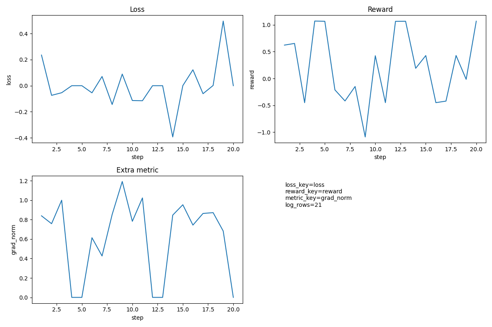
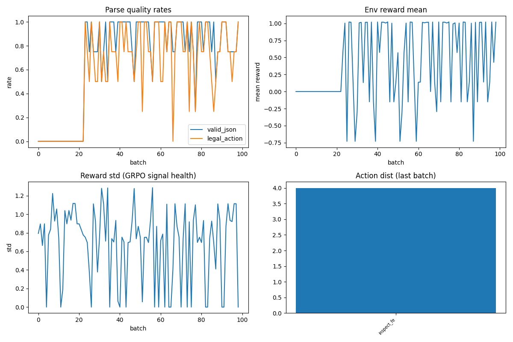
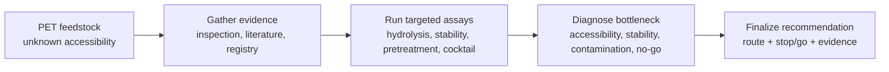
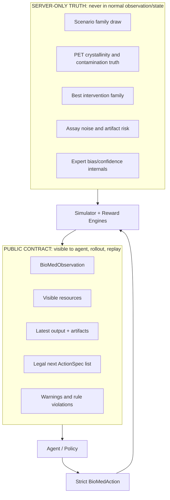
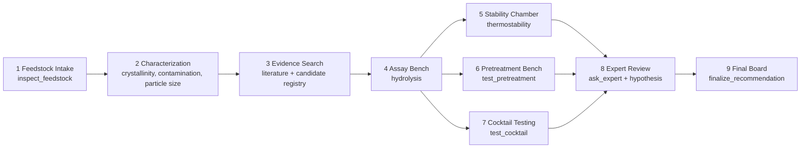
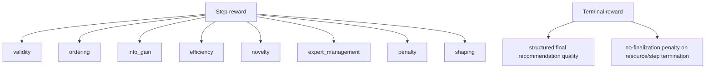
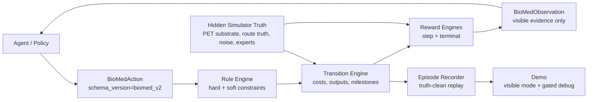

# BioMed

[](https://huggingface.co/docs/openenv)


**BioMed is an OpenEnv-native benchmark for PET bioremediation experiment planning under hidden biological state.**

The agent acts as a scientific program lead, not a chatbot. It must spend limited budget and time, inspect PET feedstock, gather noisy evidence, query simulated experts, run assays, diagnose the hidden bottleneck, and submit a structured final recommendation. The environment rewards scientifically valid workflow behavior and final decision quality through a decomposed reward signal.

BioMed is built to be judged as a benchmark artifact:

- **OpenEnv control loop:** typed `reset`, `step`, and `state` interactions.
- **Strict public contract:** canonical `biomed_v2` action, observation, state, reward, and metric schemas.
- **Hidden-state simulator:** latent PET substrate, intervention, assay noise, expert bias, and episode economics.
- **Deterministic episodes:** same seed, scenario, difficulty, and actions produce reproducible trajectories.
- **Training-ready substrate:** baselines, rollout collection, replay rendering, evaluation metrics, and optional GRPO training.
- **Demo:** browser UI for live demo, replay inspection, reward breakdowns, and explicitly gated hidden-truth debug mode.

> BioMed is not a generic app and not a wet-lab automation platform. It is a PET-only, hidden-state, long-horizon OpenEnv benchmark for evaluating scientific planning agents.

For the longer narrative / Hugging Face-style writeup, see [BioMed_blog.md](BioMed_blog.md).

## Links

- [Project video / presentation](https://drive.google.com/file/d/1Tl4btcO9BJSN1-o-DbJwHh1drMIUkOLi/view?usp=sharing)
- [Hugging Face blog mirror](https://huggingface.co/spaces/theRake/bioMed/blob/main/BioMed_blog.md)

## Training Evidence





---

## Why This Benchmark Matters

Most science-agent demos reward fluent explanations. BioMed rewards **decision quality under partial observability**.

In each episode, the agent sees only public observations: artifacts, warnings, expert messages, legal actions, resources, and noisy assay outputs. The ground truth remains server-side. A strong policy must infer whether the real bottleneck is substrate accessibility, thermostability, contamination artifact, cocktail synergy, route mismatch, or a true no-go case.

| Benchmark dimension      | BioMed implementation                                                                                                 |
| ------------------------ | --------------------------------------------------------------------------------------------------------------------- |
| **POMDP structure**      | Hidden scenario truth and noisy outputs are separated from visible state.                                             |
| **Typed action space**   | Agents submit canonical `BioMedAction` objects, not free-form prose.                                                  |
| **Scientific workflow**  | Inspection, characterization, registry search, assays, experts, hypotheses, final recommendation.                     |
| **Reward decomposition** | Validity, ordering, information gain, efficiency, novelty, expert management, penalties, shaping, terminal quality.   |
| **Evaluation integrity** | Public trajectories stay truth-clean; private truth sidecars enable offline benchmark metrics.                        |
| **Judge legibility**     | Static UI cockpit explains resources, evidence, reward history, violations, uncertainty, and debug-only hidden truth. |

---

## Visual Snapshot

### What The Agent Is Trying To Do



### Public vs Hidden Boundary



### PET Workflow Map



### Reward Stack



---

## The Core Loop



One step follows this order:

1. Validate the submitted `BioMedAction`.
2. Check scientific and resource legality.
3. Apply costs and transition hidden simulator state.
4. Generate a noisy public output artifact.
5. Compute decomposed step reward.
6. Add terminal reward if the episode ended.
7. Return the next public observation.
8. Record a truth-clean snapshot for replay and UI.

---

## Domain Model

BioMed is PET-only by design.

PET remediation is difficult because enzymatic degradation depends on substrate accessibility, crystallinity, contamination, temperature stability, catalyst fit, route economics, and noisy evidence. BioMed turns that uncertainty into an interactive benchmark.

### Canonical Scenario Families

The current benchmark ships four canonical scenario families:

| Scenario                     | What it tests                                                                                  |
| ---------------------------- | ---------------------------------------------------------------------------------------------- |
| `high_crystallinity`         | The hidden bottleneck is PET accessibility; pretreatment may matter more than enzyme swapping. |
| `thermostability_bottleneck` | A promising route may fail under realistic operating temperature.                              |
| `contamination_artifact`     | Observed assay signal can be misleading because contamination distorts evidence.               |
| `no_go`                      | The best decision is to stop rather than burn budget on an uneconomic route.                   |

### Canonical Intervention Families

Final recommendations use intervention families, not scenario labels:

| Family                 | Meaning                                                              |
| ---------------------- | -------------------------------------------------------------------- |
| `pretreat_then_single` | Improve substrate accessibility before enzymatic treatment.          |
| `thermostable_single`  | Favor a single robust catalyst route.                                |
| `cocktail`             | Use a multi-agent or multi-enzyme route.                             |
| `no_go`                | Stop because the evidence and economics do not support continuation. |

---

## Public Contract

The canonical public contract lives in `biomed_models/` and uses schema version `biomed_v2`.

| Model layer                      | Purpose                                                                                    |
| -------------------------------- | ------------------------------------------------------------------------------------------ |
| `biomed_models/contract.py`      | Canonical enums, schema version, reward keys, metrics, action costs, and legal vocabulary. |
| `biomed_models/actions.py`       | Strict `BioMedAction` model.                                                               |
| `biomed_models/action_params.py` | Typed action-specific parameter models.                                                    |
| `biomed_models/observation.py`   | Public `BioMedObservation`, legal action specs, resources, and episode info.               |
| `biomed_models/state.py`         | Visible-only operational state.                                                            |
| `biomed_models/reward.py`        | Canonical reward breakdown validation.                                                     |

All canonical public models forbid extra fields. Old action names and loose payload shapes are not accepted as normal contract behavior.

### Action Surface

| Track                   | Canonical action kinds                                                           |
| ----------------------- | -------------------------------------------------------------------------------- |
| Intake                  | `inspect_feedstock`                                                              |
| Evidence search         | `query_literature`, `query_candidate_registry`                                   |
| Sample characterization | `measure_crystallinity`, `measure_contamination`, `estimate_particle_size`       |
| Route screening         | `estimate_stability_signal`, `run_hydrolysis_assay`, `run_thermostability_assay` |
| Intervention testing    | `test_pretreatment`, `test_cocktail`                                             |
| Expert and reasoning    | `ask_expert`, `state_hypothesis`                                                 |
| Terminal decision       | `finalize_recommendation`                                                        |

Examples of contract-enforced requirements:

- `ask_expert` requires `parameters.expert_id`.
- `run_hydrolysis_assay` requires `parameters.candidate_family`.
- `finalize_recommendation` requires `bottleneck`, `recommended_family`, `decision_type`, `summary`, and evidence references.
- `legal_next_actions` returns rich `ActionSpec` objects, not ambiguous strings.

---

## Architecture

```text
bioMed/
├── biomed_models/          # Canonical public schema and vocabulary
├── server/
│   ├── app.py              # FastAPI/OpenEnv app and HTTP session handling
│   ├── bioMed_environment.py
│   ├── rules/              # Legality and workflow constraints
│   ├── simulator/          # Hidden latent state, scenarios, transitions, observations
│   ├── rewards/            # Step reward, terminal reward, shaping, config
│   └── ui/                 # Demo recorder, store, serializers, static UI
├── training/               # Baselines, parsing, rollouts, replay, evaluation, GRPO harness
├── tests/                  # Unit, contract, integration, API, and e2e tests
├── openenv.yaml            # OpenEnv manifest
└── pyproject.toml
```

The environment is intentionally layered:

- **Public model layer:** strict, typed, visible-only benchmark contract.
- **Hidden simulator layer:** PET truth, scenario sampling, stochastic outputs, and internal milestones.
- **Rules layer:** hard blocks and soft scientific warnings.
- **Reward layer:** decomposed step and terminal scoring.
- **Training/evaluation layer:** canonical action parsing, baselines, rollout collection, replay, and metrics.
- **UI layer:** downstream visualization over recorded snapshots, never a second source of simulator truth.

---

## Quick Start

### Install

```bash
python3 -m venv .venv
source .venv/bin/activate
pip install -e ".[dev]"
```

### Validate

```bash
openenv validate
python3 -m pytest tests/unit tests/contract tests/integration -q
python3 -m pytest tests/api tests/e2e -q
```

### Run The Server

```bash
uvicorn server.app:app --host 0.0.0.0 --port 8000 --reload
```

OpenEnv manifest:

```yaml
name: bioMed
runtime: fastapi
app: server.app:app
port: 8000
```

Core routes:

| Route         | Purpose                                           |
| ------------- | ------------------------------------------------- |
| `GET /schema` | Canonical reset/action/observation/state schemas. |
| `POST /reset` | Reset the current HTTP session environment.       |
| `POST /step`  | Apply one canonical `BioMedAction`.               |
| `GET /state`  | Return visible-only state.                        |
| `GET /ui`     | Serve the Demo.                                   |

---

## Python Client Example

```python
from client import BioMedEnv
from models import ActionKind, BioMedAction

env = BioMedEnv(base_url="http://localhost:8000")
client = env.sync()

client.reset(seed=7, scenario_family="high_crystallinity", difficulty="easy")

result = client.step(
    BioMedAction(
        action_kind=ActionKind.INSPECT_FEEDSTOCK,
        rationale="Start with feedstock triage before choosing assays.",
        confidence=0.60,
    )
)

print(result.observation.stage)
print(result.reward)

env.close()
```

The canonical model package is `biomed_models`. The root `models.py` module re-exports the same public contract for simple examples.

---

## Demo

BioMed includes a static judge/demo UI. It is a cockpit over the benchmark, not the benchmark itself.

Start the server and open:

```text
http://localhost:8000/ui
```

The cockpit shows:

- Current scenario, difficulty, stage, status, step count, budget, and time.
- PET workflow stations and active action location.
- Legal next actions and current action rationale.
- Latest output, artifacts, expert messages, discoveries, warnings, and violations.
- Step reward, cumulative reward, reward history, and component breakdown.
- Replay export as JSON or Markdown.
- Optional hidden-truth judge panel when debug mode is explicitly enabled.

Debug mode is off by default:

```bash
BIOMED_UI_DEBUG=true uvicorn server.app:app --host 0.0.0.0 --port 8000 --reload
```

When debug mode is disabled, hidden truth is redacted to preserve the POMDP boundary. Normal observations, visible state, public rollouts, and public replay exports must remain truth-clean.

---

## Reward Design

BioMed reward is decomposed so policies can be debugged and compared.

| Component           | What it measures                                                    |
| ------------------- | ------------------------------------------------------------------- |
| `validity`          | Whether the action is legal and executable.                         |
| `ordering`          | Whether the action fits the current scientific workflow stage.      |
| `info_gain`         | Whether the action produced useful uncertainty-reducing evidence.   |
| `efficiency`        | Whether the policy used budget and time responsibly.                |
| `novelty`           | Whether the action avoids redundant low-value repetition.           |
| `expert_management` | Whether expert consultations are useful and followed appropriately. |
| `penalty`           | Invalid, premature, redundant, or wasteful behavior.                |
| `shaping`           | Potential-based progress over benchmark milestones.                 |
| `terminal`          | Final recommendation quality or no-finalization penalty.            |

Terminal quality evaluates structured fields, not prose alone:

- predicted bottleneck,
- recommended intervention family,
- stop/go decision,
- evidence references,
- confidence calibration,
- resource-aware finalization timing.

---

## Rollouts, Replay, And Evaluation

Collect public rollouts:

```bash
python3 -m training.rollout_collection \
  --policy cost_aware_heuristic \
  --episodes 8 \
  --output-dir outputs
```

Collect benchmark rollouts with private truth sidecar:

```bash
python3 -m training.rollout_collection \
  --policy cost_aware_heuristic \
  --episodes 8 \
  --capture-latent-truth \
  --require-benchmark-metrics \
  --output-dir outputs
```

Render replay Markdown:

```bash
python3 -m training.replay \
  --input outputs/rollouts/cost_aware_heuristic.jsonl \
  --truth-sidecar outputs/private_truth/cost_aware_heuristic_truth.json \
  --output outputs/replays/cost_aware_heuristic.md
```

Evaluate:

```bash
python3 -m training.evaluation \
  --input outputs/rollouts/cost_aware_heuristic.jsonl \
  --truth-sidecar outputs/private_truth/cost_aware_heuristic_truth.json
```

Built-in baseline policies:

| Policy                       | Purpose                                                       |
| ---------------------------- | ------------------------------------------------------------- |
| `random_legal`               | Samples legal actions to test contract and exploration floor. |
| `characterize_first`         | Prioritizes sample characterization before route testing.     |
| `cost_aware_heuristic`       | Balances evidence gathering with budget/time pressure.        |
| `expert_augmented_heuristic` | Uses expert messages as part of workflow planning.            |

---

## Metrics

BioMed reports online metrics and offline benchmark metrics.

Online metrics work from public trajectory data:

- mean return,
- median return,
- return standard deviation,
- mean episode length,
- success rate when success is known,
- success-known fraction.

Benchmark metrics require private truth sidecars:

- workflow hard-validity rate,
- workflow soft-validity rate,
- ordering score,
- action diversity,
- mean conclusion confidence,
- bottleneck accuracy,
- intervention family accuracy,
- stop/go accuracy,
- information gain per cost,
- expert usefulness score,
- hard and soft violation step rates,
- finalization rate.

If truth is unavailable, benchmark metrics fail closed instead of silently pretending success is known.

---

## Optional Training: Unsloth GRPO

Install training extras:

```bash
pip install -e ".[train]"
```

Curriculum smoke run:

```bash
python -m training.training_unsloth \
  --training-mode single_action_curriculum \
  --model-id Qwen/Qwen3-0.6B \
  --dataset-episodes 32 \
  --rollout-steps 3 \
  --trainer-max-steps 120 \
  --num-generations 4 \
  --max-seq-length 1024 \
  --lora-r 8 \
  --lora-alpha 16 \
  --gradient-accumulation-steps 2 \
  --output-dir outputs/training/curriculum_smoke_120
```

Full-action GRPO run:

```bash
python -m training.training_unsloth \
  --training-mode full_action_grpo \
  --model-id Qwen/Qwen3-0.6B \
  --dataset-episodes 64 \
  --rollout-steps 5 \
  --trainer-max-steps 150 \
  --num-generations 4 \
  --max-seq-length 1536 \
  --max-prompt-length 1024 \
  --lora-r 8 \
  --lora-alpha 16 \
  --gradient-accumulation-steps 2 \
  --collection-policy mixed \
  --output-dir outputs/training/full_action_smoke_150
```

Evaluate a saved LoRA:

```bash
python -m training.evaluate_policy \
  --model-dir outputs/training/full_action_smoke_150 \
  --output-dir outputs/training/full_action_smoke_150/eval \
  --eval-episodes 64 \
  --heldout-seed-offset 10000
```

Training is optional. The benchmark artifact is the environment contract, simulator, reward, evaluator, and replay system.

---

## Docker And OpenEnv Packaging

Build locally:

```bash
docker build -f server/Dockerfile -t biomed-env:latest .
```

Push through OpenEnv tooling:

```bash
openenv push
```

The Docker image serves the FastAPI app declared in `openenv.yaml`.

---

## Test Pyramid

The test suite is organized around benchmark integrity:

| Layer       | What it protects                                                                              |
| ----------- | --------------------------------------------------------------------------------------------- |
| Unit        | Strict model validation, reward semantics, scenario construction, UI serializers.             |
| Contract    | Canonical action registry, metric schema, hidden-field bans, rule/reward/evaluator alignment. |
| Integration | Reset/step/state roundtrips, deterministic rollouts, training alignment, UI recording.        |
| API         | HTTP schema, OpenEnv endpoints, UI routes, debug redaction, replay export.                    |
| E2E         | Training surface and end-to-end benchmark flow.                                               |

Recommended full validation:

```bash
python3 -m pytest tests/unit tests/contract -q
python3 -m pytest tests/integration tests/api -q
python3 -m pytest tests/e2e -q
```

---

## Reviewer Notes

When reviewing BioMed, judge the environment spine first:

- Does the agent interact through a strict typed action contract?
- Are hidden simulator variables separated from public observation and state?
- Do rules, rewards, evaluation, replay, and training use the same vocabulary?
- Are terminal decisions scored from structured fields rather than rationale text?
- Are seeded episodes deterministic?
- Are public rollouts truth-clean?
- Does the UI explain the benchmark without becoming the benchmark?

The intended 30-second takeaway:

> BioMed is a hidden-state PET bioremediation planning environment where an agent spends limited resources, gathers noisy scientific evidence, consults experts, and is rewarded for making a calibrated final remediation or no-go decision.

For narrative context, see [BioMed_blog.md](BioMed_blog.md).
