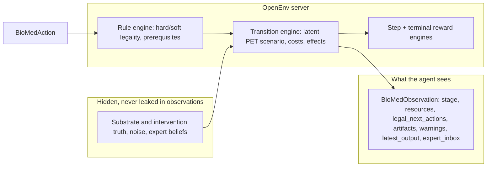

# BioMed

**A trainable, partially observable environment for scientific program planning** — not a Q&A wrapper. The agent is a PET bioremediation program lead: it operates under real **budget and time** constraints, queries noisy instruments and experts, and must **diagnose hidden bottlenecks** before committing to an intervention. Success is scored by **process quality** (legality, ordering, information gain, efficiency) and by **final recommendation** correctness, aligned with the [OpenEnv](https://huggingface.co/docs/openenv) model of **shareable, gym-style** `reset` / `step` / `state` agents.

> **OpenEnv is the product.** This repo is an environment artifact: typed contracts, a rule engine, a latent simulator, decomposed rewards, a FastAPI + WebSocket server, and evaluation/replay tooling so judges and the community can **run, test, and extend** the benchmark — not just read a demo script.

---

## Why judges should care

| Dimension | What BioMed demonstrates |
|----------|----------------------------|
| **Environment-first** | Gymnasium-style interaction; agents act through structured `BioMedAction`, not free-form chat. |
| **Partial observability (POMDP)** | True scenario family, noise, and expert belief live in **latent** state; observations are **evidence and artifacts** only. |
| **Actionable science** | 14 action kinds: inspection, literature/registry, characterization, assays, experts, hypothesis, finalization. |
| **Reproducibility** | Same **seed** + scenario family + difficulty yields the same episode draw for fair comparison. |
| **Extensibility** | Clear layers: `biomed_models/` (public contract) → `server/simulator/`, `server/rules/`, `server/rewards/` → `training/`. |

---

## Environment at a glance



- **`openenv.yaml`** — manifest: name `bioMed`, FastAPI app `server.app:app`, port `8000`.
- **`server/bioMed_environment.py`** — local `BioMedEnvironment`: validation → transition → reward → observation.
- **`server/app.py`** — HTTP + WebSocket surface for remote agents and UIs.

---

## Task families (what “good” looks like)

1. **Candidate ranking** — registry and assays inform route choice without oracle leaks.  
2. **Bottleneck diagnosis** — substrate access, thermostability, contamination artifacts, synergy, or economic **no-go**.  
3. **Final recommendation** — structured `finalize_recommendation` with family, bottleneck, stop/go, and cited evidence.

Scenario families (see `server/simulator/scenarios.py`): `high_crystallinity`, `contamination_artifact`, `thermostability_bottleneck`, `no_go` (a real family, not only a label).

---

## Action surface (summary)

Full contract: `biomed_models/contract.py` — `BioMedAction` and parameter models.

| Track | Kinds |
|------|--------|
| Intake / triage | `inspect_feedstock`, `query_literature`, `query_candidate_registry` |
| Characterization | `measure_crystallinity`, `measure_contamination`, `estimate_particle_size` |
| Route screens | `estimate_stability_signal`, `run_hydrolysis_assay`, `run_thermostability_assay`, `test_pretreatment`, `test_cocktail` |
| Judgment | `ask_expert`, `state_hypothesis`, `finalize_recommendation` |

`run_hydrolysis_assay` requires `candidate_family`. `ask_expert` requires `expert_id`. The rule engine enforces **workflow order** (e.g. crystallinity only after feedstock inspection; hydrolysis after sample + candidate context).

---

## Quick start (judges & developers)

### Install

```bash
python3 -m venv .venv
source .venv/bin/activate   # Windows: .venv\Scripts\activate
pip install -e ".[dev]"
```

### Verify the environment package

```bash
openenv validate
python3 -m pytest tests/unit tests/integration -q
python3 -m pytest tests/api tests/e2e -q
```

### Run the server

```bash
uvicorn server.app:app --host 0.0.0.0 --port 8000 --reload
# or: python -m uvicorn server.app:app --host 0.0.0.0 --port 8000
```

### Judge cockpit (UI)

Open:

```text
http://localhost:8000/ui
```

Optional truth-aware debug (local only, not for blind eval):

```bash
BIOMED_UI_DEBUG=true uvicorn server.app:app --host 0.0.0.0 --port 8000 --reload
```

### Typed client (OpenEnv)

After `pip install -e .`, use the shipped client and models (re-exported from `biomed_models`):

```python
from client import BioMedEnv
from models import ActionKind, BioMedAction

env = BioMedEnv(base_url="http://localhost:8000")
env.sync().reset(seed=7)
result = env.sync().step(
    BioMedAction(
        action_kind=ActionKind.INSPECT_FEEDSTOCK,
        rationale="Triage",
        confidence=0.5,
    )
)
print(result.observation.stage)
env.close()
```

(`from biomed_models import ActionKind, BioMedAction` is equivalent to `from models import …` here.)

The **stateful** path for benchmarks is the **WebSocket** + typed client; HTTP `/reset`, `/step`, `/state` are documented for health, schema, and simple control.

---

## Rollouts, replay, and evaluation

```bash
python3 -m training.rollout_collection --policy cost_aware_heuristic --episodes 8 --output-dir outputs
```

```bash
python3 -m training.replay --input outputs/rollouts/cost_aware_heuristic.jsonl \
  --truth-sidecar outputs/private_truth/cost_aware_heuristic_truth.json \
  --output outputs/replays/cost_aware_heuristic.md
```

```bash
python3 -m training.evaluation --input outputs/rollouts/cost_aware_heuristic.jsonl \
  --truth-sidecar outputs/private_truth/cost_aware_heuristic_truth.json
```

Public rollout JSONL stays **truth-clean**; benchmark-side truth for offline scoring is in a **private sidecar**.

---

## Training (optional) — Unsloth GRPO

Install train extras: `pip install -e ".[train]"` and follow `requirements-unsloth.txt` if using Unsloth. Reward in full-action mode is **state-dependent** from the same `BioMedEnvironment` logic as the server, plus a small **format bonus** for valid JSON (see `training/training_unsloth.py`).

| Mode | Role |
|------|------|
| `single_action_curriculum` | Narrow action set, sanity / format gate |
| `full_action_grpo` | Full 14 action kinds, state-dependent reward |

**Curriculum smoke**

```bash
python -m training.training_unsloth \
  --training-mode single_action_curriculum \
  --model-id Qwen/Qwen3-0.6B \
  --dataset-episodes 32 --rollout-steps 3 --trainer-max-steps 120 \
  --num-generations 4 --max-seq-length 1024 --lora-r 8 --lora-alpha 16 \
  --gradient-accumulation-steps 2 \
  --output-dir outputs/training/curriculum_smoke_120
```

**Full-action GRPO (main)**

```bash
python -m training.training_unsloth \
  --training-mode full_action_grpo \
  --model-id Qwen/Qwen3-0.6B \
  --dataset-episodes 64 --rollout-steps 5 --trainer-max-steps 150 \
  --num-generations 4 --max-seq-length 1536 --max-prompt-length 1024 \
  --lora-r 8 --lora-alpha 16 --gradient-accumulation-steps 2 \
  --collection-policy mixed \
  --output-dir outputs/training/full_action_smoke_150
```

**Evaluate a saved LoRA**

```bash
python -m training.evaluate_policy \
  --model-dir outputs/training/full_action_smoke_150 \
  --output-dir outputs/training/full_action_smoke_150/eval \
  --eval-episodes 64 --heldout-seed-offset 10000
```

---

## Docker & Hugging Face Spaces

```bash
docker build -f server/Dockerfile -t biomed-env:latest .
```

```bash
openenv push
```

Exposed routes include `GET /health`, `GET /schema`, stateful control, and `WebSocket` for the benchmark path.

---

## Project layout

```text
bioMed/
├── openenv.yaml              # OpenEnv manifest
├── biomed_models/            # Public Pydantic contracts + action/observation types
├── server/                   # FastAPI app, BioMedEnvironment, simulator, rules, rewards, UI
├── training/                 # Rollouts, replay, evaluation, baselines, Unsloth GRPO
├── tests/                    # unit, integration, API, e2e
└── pyproject.toml
```

---

## Notes for reviewers

- Judge the **environment contract** first: legality, partial observability, and reward design — training weights are an optional layer.  
- Same-seed episodes and hidden-state evaluation are first-class.  
- For a deeper narrative, see [BioMed_blog.md](BioMed_blog.md).  

**BioMed** — *science as interaction, not as a paragraph.*
